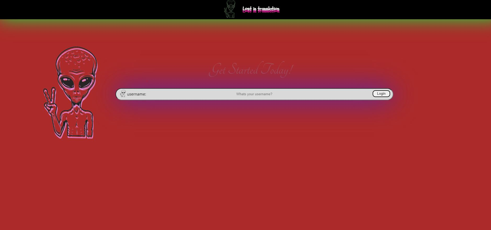
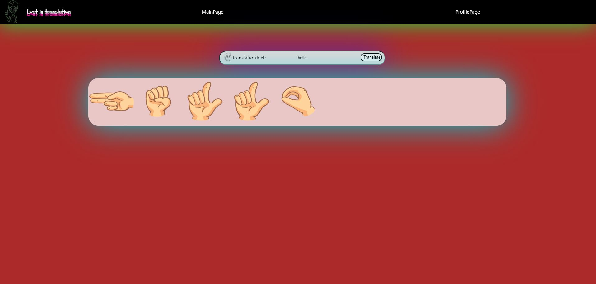
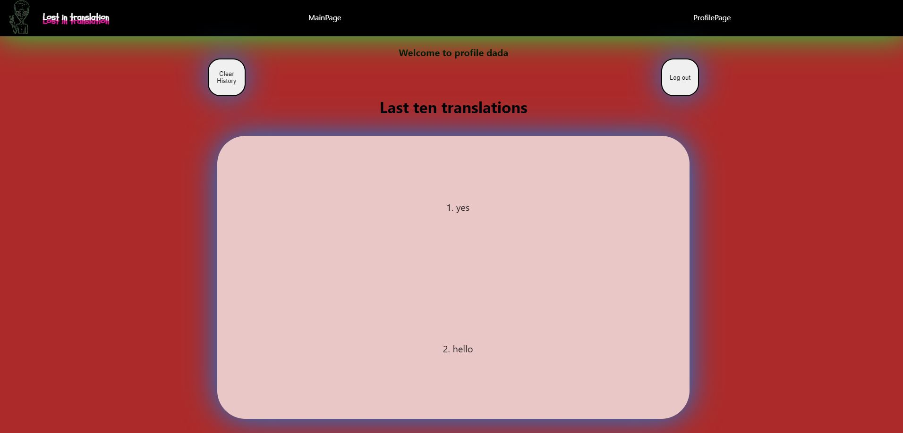

# Assignment-2-Frontend-Development-with-React

This is a react application for assignment 2 on noroff

## Description
This project offers three navigation elements. The login-, main- and profilepage. In the login you can write down your username, which will then prompt where you can register an account if you have not done that yet. If the user exists, it will navigate to the mainpage. Here you can write down some text in the input which will then return sign language equal to the inputtext. Then the user can navigate to the profile which will display your ten last translations. In the profile are two buttons. One, clear history, that will clear all your translations and second the logout button. If you press the logout, you will return to loginpage. 

## Installation

```bash
Clone the project
npm install on root folder
use "cd assignment_2"
npm start
```

## Usage

```bash
This application requires a file, .env with variables to work correctly:
REACT_APP_API_KEY=<ApiKey>
REACT_APP_API_URL=<ApiUrl>

```

## Visuals




## License
Some of the pictures in the public/Assets folder are taken from freepik.com or created by me. The pictures in signAssets are provided from noroff.
